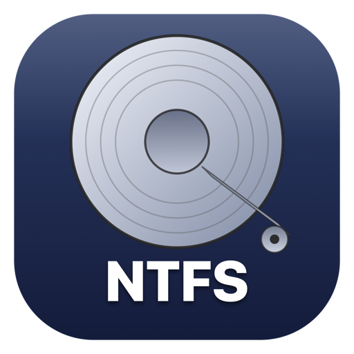
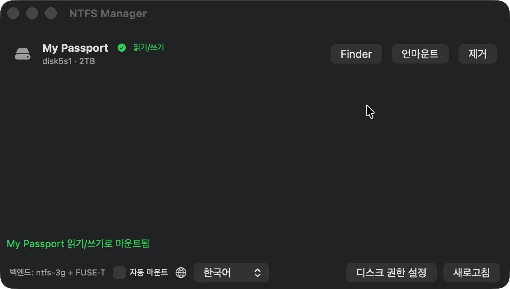

<p align="center">
  
</p>

<h1 align="center">NTFS Manager</h1>

<p align="center">
  macOS에서 NTFS 볼륨을 <b>읽기/쓰기</b>로 관리하는 오픈소스 유틸리티<br>
  <sub>Backend: <a href="https://www.fuse-t.org/">FUSE-T</a> (kextless FUSE) +
  <a href="https://github.com/macos-fuse-t/ntfs-3g">ntfs-3g</a> · 한국어/English 지원</sub>
</p>

<p align="center">
  
</p>

커널 확장 없이, Reduced Security 없이, Apple Silicon에서 동작합니다.
NTFS 드라이브를 꽂으면 목록에 표시되고, 버튼 한 번으로 읽기/쓰기로
마운트됩니다.

## 기능

- NTFS 볼륨 자동 감지 (GPT `Microsoft Basic Data` / MBR `Windows_NTFS` 모두)
- 읽기/쓰기 마운트 · 언마운트 · 제거 · 복구(ntfsfix)
- **권한 헬퍼(선택)** — launchd 데몬, 설치 시 1회 승인 후 이후 작업은
  비밀번호 없이 동작. 미설치 시 osascript 관리자 프롬프트로 폴백
- 자동 마운트 옵션 + 작업 완료 시 macOS 알림
- 한국어/English — 시스템 언어 자동 적용, 앱 내 🌐 피커로 즉시 전환
- CLI(`ntfs-cli`)로 같은 기능을 터미널에서 사용

## 요구사항

- macOS 14+ (개발/테스트: macOS 26, Apple Silicon M1 Max)
- Homebrew
- Xcode CLT (`xcode-select --install`) — 소스 빌드용
- 물리 디스크 사용 시 **전체 디스크 접근 권한(Full Disk Access)** — 아래 참조

## 설치

```bash
git clone https://github.com/jaymunsh/ntfs-manager && cd ntfs-manager
./Scripts/install-deps.sh   # FUSE-T(유저스페이스 ~/.fuse-t) + ntfs-3g — 비밀번호 없이 설치
./Scripts/bundle-app.sh     # build/NTFSManager.app 생성
open build/NTFSManager.app
```

내부 동작:
1. `brew fetch --cask fuse-t`로 pkg를 받아 페이로드를 `~/Library/Application
   Support/fuse-t`와 `~/.fuse-t`에 풀어놓습니다 (sudo pkg 설치 대신
   postinstall의 non-root 경로 재현)
2. 이 repo를 로컬 tap으로 등록하고 `ntfs-3g-fuset` formula를 빌드해
   `/opt/homebrew`에 설치

GitHub에서 직접 설치하려면: `brew install --cask fuse-t` 후
`brew tap jaymunsh/ntfs-manager https://github.com/jaymunsh/ntfs-manager && brew install ntfs-3g-fuset`

## 사용

### 앱

NTFS 드라이브를 연결하면 목록에 표시됩니다. macOS가 읽기전용으로 자동
마운트한 볼륨은 "읽기/쓰기로 마운트" 버튼으로 재마운트합니다.
하단의 "자동 마운트"를 켜면 연결 시 자동으로 읽기/쓰기 마운트됩니다.

### CLI

```bash
.build/release/ntfs-cli deps       # 의존성 상태
.build/release/ntfs-cli list       # NTFS 볼륨 목록
.build/release/ntfs-cli mount-rw disk4s1   # 읽기/쓰기 마운트
.build/release/ntfs-cli unmount disk4s1
.build/release/ntfs-cli eject disk4s1
.build/release/ntfs-cli repair disk4s1     # ntfsfix
.build/release/ntfs-cli install-helper     # 권한 헬퍼 설치 (1회 관리자 승인)
```

### 권한 헬퍼

`ntfs-helper`는 launchd 데몬으로 `/var/run/ntfs-manager-helper.sock`
(root:admin 0660)를 통해 검증된 디스크 작업만 실행합니다 — 임의 셸 명령은
받지 않으며, 실행 바이너리(diskutil/ntfs-3g/ntfsfix/umount)와 인자 형식
(`/dev/diskNsM`, `/Volumes/*`)을 화이트리스트로 검증합니다. 설치는 앱의
설치 가이드 또는 `ntfs-cli install-helper`로, 관리자 승인은 최초 1회입니다.
헬퍼가 설치되지 않았거나 응답하지 않으면 osascript 프롬프트로 자동 폴백합니다.

제거하려면:

```bash
sudo launchctl bootout system/com.leneu.ntfs-manager.helper
sudo rm /Library/LaunchDaemons/com.leneu.ntfs-manager.helper.plist \
        /Library/PrivilegedHelperTools/ntfs-manager-helper
```

### 전체 디스크 접근 권한 (필수)

macOS의 TCC 때문에 root 권한과 별개로, 물리 디스크의 raw device 접근에는
**전체 디스크 접근 권한(Full Disk Access)**이 필요합니다. 첫 마운트 시도에서
`Operation not permitted`가 뜨면:

1. 시스템 설정 → 개인정보 보호 및 보안 → 전체 디스크 접근 권한
   (앱 하단 "디스크 권한 설정" 버튼으로 바로 열 수 있습니다)
2. 목록에 자동 추가된 **`ntfs-3g` 토글 ON** — 실제 디스크를 여는 바이너리
3. `+`로 **NTFSManager.app**도 추가 (앱 경로로 실행할 때 책임 프로세스)
   - CLI로 쓰는 경우 실행 중인 터미널 앱(Ghostty, Terminal 등)에도 부여
4. `ntfsfix`로 복구할 때도 같은 권한이 필요합니다 (첫 거부 시 목록에 자동 추가됨)

디스크 이미지 파일만 다루는 경우 이 권한은 필요 없습니다.

## 주의사항

- **개인용 도구입니다. 중요한 데이터가 든 드라이브는 백업 후 사용하세요.**
  마운트 라이프사이클과 간단한 파일 이동은 실물 드라이브로 확인했지만,
  대용량 전송 성능·특수 파일명·중단 복구 같은 영역은 아직 검증이 진행 중입니다.
- 서명/공증되지 않은 앱이라 첫 실행 시 Gatekeeper 경고가 뜹니다.
  우클릭 → 열기로 우회하거나, 소스에서 직접 빌드하는 것이 기본 경로입니다.
- Windows가 **최대절전모드/빠른시작** 상태로 종료된 볼륨은 ntfs-3g가 쓰기 마운트를
  거부합니다. Windows에서 완전히 종료(Shift+종료) 후 연결하세요.
- dirty 볼륨은 마운트 시 ntfs-3g `recover`로 저널 복구를 자동 시도하고,
  그래도 거부되면 "복구"(ntfsfix) 또는 Windows의 chkdsk가 필요합니다.
- FUSE-T는 NFS loopback 방식이라 대용량 파일 성능이 네이티브보다 낮을 수 있습니다.
- 검증됨: NTFS 이미지 + 실제 2TB WD My Passport 드라이브에서 감지·R/W 마운트·
  쓰기·언마운트·제거 확인 (헬퍼 경로 포함).

## 개발 문서

개발 과정과 아키텍처 선택 이유(FSKit 검토, TCC 함정, 헬퍼 설계 등)는
[docs/ntfs-manager-dev-story.md](docs/ntfs-manager-dev-story.md)에
상세히 기록했습니다.

## 라이선스

- 이 프로젝트(앱/라이브러리 코드): MIT
- ntfs-3g: GPL-2.0+/LGPL-2.0+ (서브프로세스로 실행, 링크 없음)
- FUSE-T: fuse-t.org 배포 바이너리 (무료, 클로즈드소스 — 별도 설치되는
  런타임 의존성)
